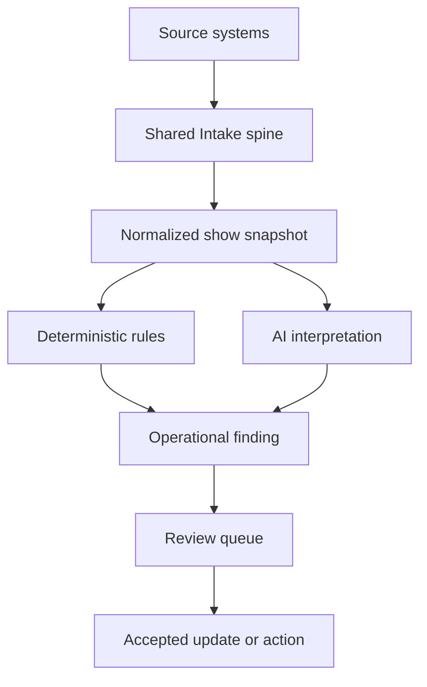

# CUE Intelligence Rules Layer v1

**Status:** Implementation-ready foundation  
**Purpose:** Turn FLEX, CUE, Slack, email, Drive, Motive, and Intake records into explainable operational findings without allowing AI to silently rewrite source-of-truth data.

## 1. Outcome

The Intelligence Rules Layer answers four questions for every active show:

1. What appears to be wrong, risky, incomplete, or newly changed?
2. What evidence supports that conclusion?
3. How urgent and how reliable is it?
4. What should a person review or do next?

The layer produces **findings**, not direct mutations. A finding may propose an update, but a human accepts, modifies, rejects, snoozes, or marks it informational unless a future rule is explicitly approved for automation.

## 2. Architecture boundary



### The Intake spine owns

- Source capture and deduplication
- Source identity and timestamps
- Show matching candidates
- Extracted facts and proposed updates
- Review status and source evidence

### The Intelligence Rules Layer owns

- Evaluation of normalized show facts
- Cross-source comparisons
- Operational thresholds and timing windows
- Finding severity and confidence
- Explanation, evidence references, and recommended action
- Suppression, snooze, resolution, and recurrence behavior

### Active Show Sheet owns

- Presentation of current readiness
- Finding summaries and drill-down
- User actions that route findings into review or workflow

## 3. Core principles

1. **Evidence before assertion.** Every finding points to the specific fields, messages, files, or status records that caused it.
2. **No silent truth changes.** AI proposals remain proposals until reviewed.
3. **Deterministic where possible.** Dates, counts, missing assignments, and status comparisons use explicit logic.
4. **AI for ambiguity.** AI interprets human language, aliases, semantic conflicts, and operational meaning.
5. **Calm escalation.** CUE surfaces the smallest useful warning at the right time; it does not generate alarm noise.
6. **Unknown is not false.** Missing data produces a data-gap finding when material; it does not prove that a risk exists.
7. **One finding per operational issue.** Multiple evidence items should strengthen one finding rather than create duplicates.
8. **Explainable resolution.** A finding records why it opened, changed severity, was dismissed, or resolved.

## 4. Standard finding contract

Every rule emits the same finding structure.

| Field | Purpose |
|---|---|
| `finding_id` | Stable instance identifier |
| `rule_id` / `rule_version` | Rule and logic version that created it |
| `show_id` | Matched CUE/FLEX show |
| `domain` | Intake, labor, trucking, warehouse, equipment, schedule, communication, or financial |
| `title` | Short operational statement |
| `summary` | Plain-language explanation |
| `severity` | Info, Watch, Needs Attention, or Critical |
| `confidence` | Low, Medium, or High plus numeric score |
| `status` | Open, Acknowledged, Snoozed, Resolved, Dismissed, or Superseded |
| `evidence_refs` | Source records and exact fields supporting the finding |
| `missing_inputs` | Required facts that were unavailable |
| `recommended_action` | Smallest useful next action |
| `proposed_update` | Optional structured update for review |
| `owner_role` | PM, staffing, trucking, warehouse, finance, admin, or executive |
| `first_detected_at` | First evaluation that opened the finding |
| `last_evaluated_at` | Latest evaluation time |
| `due_at` | When the action becomes operationally late |
| `dedupe_key` | Stable key preventing duplicate findings |

## 5. Severity and confidence

### Severity

| Level | CUE meaning | Typical behavior |
|---|---|---|
| Info | Useful context; no action required | Visible in detail view |
| Watch | Early indicator or non-urgent gap | Included in readiness summary |
| Needs Attention | Action should be assigned or reviewed | Prominent on row/card and review queue |
| Critical | Immediate risk to execution, safety, contractual delivery, or revenue | Red state and direct owner escalation |

Severity is based on **impact × time proximity × certainty of the underlying fact**. Confidence does not automatically reduce severity: a potentially critical but uncertain issue may remain Critical while clearly labeled as requiring verification.

### Confidence

| Level | Standard |
|---|---|
| High | Direct structured fact, exact identifier match, or corroborated evidence |
| Medium | Strong semantic inference or one reliable unstructured source |
| Low | Ambiguous language, uncertain show match, or material missing context |

Suggested numeric bands: High `0.85–1.00`, Medium `0.60–0.84`, Low `<0.60`.

## 6. Rule execution lifecycle

Rules run when:

- A new Intake record is accepted or materially updated
- FLEX or CUE changes the normalized show snapshot
- A milestone window is crossed, such as 14, 7, 3, 1 days before ship, load-in, doors, or load-out
- A user requests a manual show analysis
- A finding's snooze expires

Each run must:

1. Load a time-consistent show snapshot.
2. Check whether required inputs exist.
3. Evaluate deterministic rules.
4. Invoke AI only for rules requiring semantic interpretation.
5. Deduplicate against existing findings.
6. Open, update, resolve, or leave the finding unchanged.
7. Record the rule version and evidence used.

## 7. Initial rule catalog

### Intake and cross-source truth

| ID | Rule | Trigger | Default output |
|---|---|---|---|
| INT-001 | Significant change after brief distribution | Accepted source fact changes crew-facing schedule, location, scope, or assignment after latest brief | Needs Attention; regenerate/review brief and identify affected recipients |
| INT-002 | Conflicting current facts | Two active reliable sources disagree on a material field | Needs Attention; present both values and request resolution |
| INT-003 | Material update awaiting review near milestone | Proposed critical update remains pending inside its configured time window | Escalates Watch → Needs Attention → Critical as milestone approaches |
| INT-004 | Duplicate operational signal | Same source event or semantically equivalent update appears more than once | Suppress duplicate and attach evidence to existing record |
| INT-005 | Unmatched high-value signal | Signal appears show-related but show match is below acceptance threshold | Needs Attention for matching review; never attach automatically |
| INT-006 | Stale source evidence | Finding relies on superseded or expired evidence | Re-evaluate and supersede or lower confidence |

### Labor and staffing

| ID | Rule | Trigger | Default output |
|---|---|---|---|
| LAB-001 | Required position unfilled | Published position remains unconfirmed inside staffing window | Watch or Needs Attention based on role criticality and days remaining |
| LAB-002 | Hard crew conflict | Confirmed person overlaps another assignment or impossible travel period | Critical; identify both assignments and staffing owner |
| LAB-003 | Tight travel turnaround | Travel or prior shift leaves less than configured recovery/travel buffer | Needs Attention; verify plan or replace assignment |
| LAB-004 | Crew call too close to operational milestone | Call-to-load-in/doors interval is below show-type threshold | Needs Attention; show actual and expected buffer |
| LAB-005 | Crew scale inconsistent with show complexity | Staffing count materially differs from approved baseline for equipment/schedule class | Watch; requires PM review, not automatic judgment |
| LAB-006 | Critical role lacks brief acknowledgment | Designated critical crew member has not acknowledged current brief | Watch → Needs Attention near call time |

### Trucking

| ID | Rule | Trigger | Default output |
|---|---|---|---|
| TRK-001 | Required run unassigned | Planned run lacks confirmed driver or vehicle inside dispatch window | Needs Attention; assign driver/vehicle |
| TRK-002 | Capacity risk | Estimated load exceeds vehicle capacity or required capacity data is missing near ship | Critical if exceeded; Needs Attention if material data gap |
| TRK-003 | Arrival margin too small | Planned departure plus expected travel leaves insufficient arrival/load-in buffer | Needs Attention; show timing calculation |
| TRK-004 | Vehicle or driver overlap | Vehicle or driver is assigned to incompatible simultaneous runs | Critical |
| TRK-005 | Rental or temporary vehicle lacks tracking plan | Required temporary tracker is not assigned/confirmed | Watch → Needs Attention before departure |
| TRK-006 | Multi-stop dependency at risk | Earlier stop delay or incomplete load threatens later show/run | Needs Attention with affected downstream stop |

### Warehouse readiness

| ID | Rule | Trigger | Default output |
|---|---|---|---|
| WH-001 | Pull progress behind milestone | Pull completion is below configured target relative to ship date | Watch or Needs Attention |
| WH-002 | Load not confirmed before departure window | Required load status remains incomplete inside final window | Critical |
| WH-003 | Dock conflict | Two incompatible loads occupy same dock/time capacity | Needs Attention |
| WH-004 | Unresolved shortage or subrental | Required equipment shortage lacks confirmed resolution | Needs Attention → Critical near ship |
| WH-005 | Returned equipment dependency at risk | Show depends on equipment returning too close to prep/ship window | Watch; show upstream dependency |
| WH-006 | Prep scope changed after pull began | Accepted equipment/schedule change affects an in-progress or completed pull | Needs Attention; identify changed lines and recheck load |

### Equipment and technical readiness

| ID | Rule | Trigger | Default output |
|---|---|---|---|
| EQP-001 | Critical equipment shortage | Allocated quantity is below required quantity for a critical family/item | Critical |
| EQP-002 | Package completeness gap | Required companion component for an equipment family is absent | Needs Attention with rule-based explanation |
| EQP-003 | Control or signal redundancy concern | Show class requires approved redundancy but none is represented | Watch; PM/department review required |
| EQP-004 | Power information incomplete | Power requirement is material but service/distro facts are missing | Needs Attention by configured planning milestone |
| EQP-005 | Late equipment substitution | Critical item changed after technical approval or brief distribution | Needs Attention; identify compatibility and communication impact |

### Schedule and communication

| ID | Rule | Trigger | Default output |
|---|---|---|---|
| SCH-001 | Compressed load-in | Available load-in interval is below baseline for show complexity | Needs Attention; show baseline and actual interval |
| SCH-002 | Missing critical milestone | Ship, load-in, doors/show start, or load-out value required by show class is absent | Watch → Needs Attention as planning advances |
| SCH-003 | Date sequence invalid | Milestones occur in an impossible or inconsistent order | Critical |
| COM-001 | Critical decision lacks accountable owner | Accepted decision/action has no responsible role/person | Needs Attention |
| COM-002 | Important question remains unanswered | Open question classified material remains unresolved past response window | Watch or Needs Attention |
| COM-003 | Recipient-impacting change not communicated | Accepted update affects crew/client/warehouse/trucking but no communication action is recorded | Needs Attention |

### Financial and executive visibility

| ID | Rule | Trigger | Default output |
|---|---|---|---|
| FIN-001 | Confirmed show not invoiced | Confirmed/booked work lacks expected invoice by configured milestone | Watch or Needs Attention for finance |
| FIN-002 | Deposit or payment milestone at risk | Required payment is missing or overdue relative to contract/show date | Needs Attention; Critical only under approved policy |
| FIN-003 | Material scope change lacks commercial review | Accepted operational scope change may affect price but has no pricing review | Needs Attention for PM/sales/finance |
| FIN-004 | Revenue status conflicts across systems | Booking/invoice/payment status disagrees between authoritative systems | Needs Attention; show authoritative sources and conflict |

## 8. Rule definition template

Every production rule must define:

```yaml
rule_id: LAB-001
version: 1
domain: labor
title: Required position unfilled
mode: deterministic
required_inputs:
  - show.status
  - show.load_in_at
  - staffing.positions[].status
condition:
  description: Published required position is not confirmed inside its staffing window
severity:
  strategy: time_and_criticality
confidence:
  strategy: structured_source_quality
evidence:
  - staffing.position_id
  - staffing.role
  - staffing.status
  - show.load_in_at
recommended_action: Assign or confirm the position
owner_role: staffing
dedupe_key: "LAB-001:{show_id}:{position_id}"
resolution: Position becomes confirmed, removed, or show is canceled
```

## 9. AI participation policy

AI may:

- Extract proposed dates, locations, roles, quantities, decisions, and action owners from unstructured sources
- Determine whether two phrases likely refer to the same operational fact
- Identify likely contradictions and explain their significance
- Classify an update as labor, trucking, warehouse, equipment, schedule, communication, or financial
- Recommend candidate show matches and operational actions

AI may not:

- Confirm an uncertain show match without meeting the approved threshold
- Replace FLEX/CUE structured truth without review
- Invent missing schedule, staffing, vehicle, equipment, or financial facts
- Treat silence as agreement or completion
- Mark a human-owned task completed without supporting system evidence

## 10. Golden-show validation framework

The first evaluation set should include five show archetypes. Real source material should be captured only where authorized; synthetic fixtures may be used to isolate rule behavior.

| Fixture | Purpose | Minimum scenarios |
|---|---|---|
| G01 Sweetwater 420 Fest | Large festival and multi-department complexity | Staffing gaps, multi-truck dependencies, warehouse progress, post-brief change |
| G02 Harry Connick Jr. | Artist-specific and communication-sensitive show | Rider/technical update, evidence traceability, schedule conflict |
| G03 Standard corporate show | Prove low-noise normal behavior | Complete show should produce few or no actionable findings |
| G04 Trucking-heavy show | Validate runs, vehicles, drivers, tracking, and stop dependencies | Capacity risk, unassigned run, late upstream stop |
| G05 Conflict-heavy synthetic show | Exercise cross-source and review behavior | Slack/email conflict, uncertain show match, pending critical update |

### Required test record for each scenario

- Fixture and scenario ID
- Input snapshot version
- Source evidence references
- Rule expected to run
- Expected finding or expected absence of finding
- Expected severity and confidence
- Expected owner and recommended action
- Expected dedupe behavior on rerun
- Expected resolution behavior after corrected input
- Pass/fail result and reviewer notes

## 11. Acceptance criteria for v1

The layer is ready for its first live pilot when:

- All findings conform to the standard contract.
- Every actionable finding includes evidence and an owner role.
- Re-running an unchanged snapshot does not create duplicates.
- Correcting the source fact resolves or supersedes the prior finding.
- Missing inputs are distinguished from confirmed risks.
- AI-generated facts are visibly labeled as proposed or inferred.
- The normal corporate fixture produces no false Critical finding.
- All Critical findings in the golden set are detected.
- At least 90% of expected Needs Attention findings are detected in the golden set.
- A reviewer can understand why a finding exists without opening raw logs.

## 12. Recommended implementation sequence

1. Implement the finding contract and persistence model.
2. Create normalized show-snapshot input with source lineage.
3. Implement five deterministic pilot rules: `INT-002`, `LAB-001`, `TRK-001`, `WH-001`, and `SCH-003`.
4. Add deduplication, lifecycle, snooze, and resolution behavior.
5. Build golden fixtures and automated expected-finding tests.
6. Add AI-assisted `INT-001`, `INT-005`, and `FIN-003` behind human review.
7. Surface findings in the Intake Review queue and Active Show Sheet.
8. Tune thresholds with TJ, Brian, David, Chelsea, and PM feedback.

## 13. Governance decisions still requiring operating-owner input

These are configuration questions, not architectural blockers:

- TJ: staffing windows, critical roles, travel/rest buffers, acknowledgment policy
- Brian: vehicle capacity method, arrival buffers, tracker policy, multi-stop thresholds
- David: pull-progress milestones, dock capacity, dependency buffers, shortage escalation
- PM group: show-complexity bands, load-in baselines, technical completeness rules
- Christine/Chelsea: invoice, deposit, and commercial-review milestones

Until configured, these rules should run in **observe-only** mode and collect candidate findings without escalating users.

